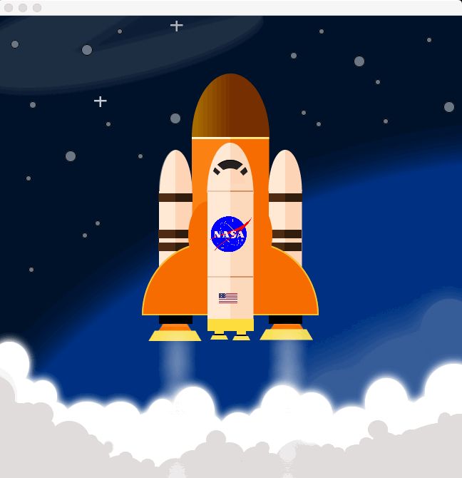

  

<h1 align="center">MDC Projects</h1>

# Description

**MDC-Projects** are some of the projects I made with differents teams in the COP2805 class at [Miami Dade College](http://mdc.edu), we were just Java Beginners at the time, so excuse our errors.

# Projects

- [Project 1](#project1)
- [Project 2](#project2)
- [Project 3](#project3)
- [Project 4](#project4)

# [Project 1](project1)

Team name: **Radicals √**

## Members

|  |  |  |
|-------------------------------------------------------------------------------------------------------------|-----------------------------------------------------------------------------------------------------|---------|
| [Carlos Abraham](https://github.com/abranhe) | [Dianet Cruz](https://github.com/diacruz) | Richard Toscano |

# [Project 2](project2)

Team name: **𝓢𝓡𝓒 Group**

## Members

|  |  |  |
|-------------------------------------------------------------------------------------------------------------|---------------------------------------------------------------------------------------|---------------------------------------------------------------------|
| [Carlos Abraham](https://github.com/abranhe) | [Andy Gonzales](https://github.com/zelaznogydna91) | [Junior Betancourt](https://github.com/jrbetancourt98) |

# [Project 3](project3/project3)

Team name: **AAA** Group

## Members

|  |  |  |
|-------------------------------------------------------------------------------------------------------------|-----------------------------------------------------------------------------------------------------|---------|
| [Carlos Abraham](https://github.com/abranhe) | [Adriel Camargo](https://github.com/adriel1221) | [Jose Adrian](https://github.com/JoseAdrianJA) |

# [Project 4](project4)

## Members

Team name: **AAA** Group

|  |  |  |
|-------------------------------------------------------------------------------------------------------------|-----------------------------------------------------------------------------------------------------|---------|
| [Carlos Abraham](https://github.com/abranhe) | [Adriel Camargo](https://github.com/adriel1221) | [Jose Adrian](https://github.com/JoseAdrianJA) |

# Contributing

> Pull requests are closed.

## Edit and upload it

I do recommend to use [GitHub Desktop](https://desktop.github.com) and watch [this video](https://www.youtube.com/watch?v=ci3W1T88mzw) to learn how to upload it to Github.

# Related 

- [mdc](https://github.com/abranhe/mdc): 🍇  Miami  Dade College Computer Science Classes Purposes.

# License

This project is released under the [Unlicense](https://github.com/abranhe/mdc-projects/tree/master/LICENSE) license.
