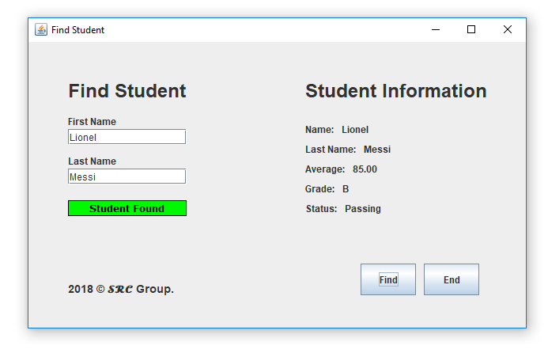

# Project 2



### Design a class **Student** that contains the following members:

- String fields **firstName**, **lastName** and **status**.
- char field **letterGrade**.
- double fields **grade1**, **grade2**, **grade3**
- double field **average**
- A two-argument constructor that takes **firstName** and **lastName** as parameters.
- **computeAverage** method. Take into account that you will have different number of grades
depending on the student.
- **computeStatus** method (If `average is < 70`, the status will be `“Failing”`. Otherwise, the status is
`“Passing”`)
- **computeLetterGrade** method (If `average <= 90` **letterGrade** is `‘A’`, If `average <= 80` **letterGrade**
is `‘B’`, If `average <= 70` **letterGrade** is `‘C’`, If `average <= 60` **letterGrade** is `‘D’`, else **letterGrade** is
`‘F’`)
- get and set methods for all fields.


### Design a class StudentList that contains the following members:

- An **ArrayList** of Student objects students.
- **readStudents** method that prompts the user for an input file name (use **JFileChooser**) and reads
the contents of the input file into students. You can expect the file to be a text file with the
following format:

```
firstName|lastName|Grade1|Grade2         //Student 1
firstName|lastName|Grade1|Grade2|Grade3  //Student 2
firstName|lastName|Grade1                //Student 3
firstName|lastName                       //Student 4
```


Sample input file contents:

```
Rodolfo|Cruz|78.6|99.7
Maria|Vargas|90.5|100|100
Julio|Perez|78.1
Juan|Rodriguez
```

#### Notes:

- Use **String.Split()** method to parse the input.
- The file could have any length; therefore, you cannot make assumptions about how many
students you’ll find in the file.
- You can assume that the information for every student will include **firsName**, **LastName**
and between `0` and `3` grades.
- Need to populate the **average**, **status** and **letterGrade** fields as appropriate.
- **saveStudentsToDB** method that prompts the user for an DataBase file name (use JFileChooser)
and writes the contents of students to the DB. The database will contain the table **StudentsTbl**
with the following columns: 

**ID** (ignore), **FirstName**, **LastName**, **Grade1**, **Grade2**, **Grade3**, **Average**, **Status** and **LetterGrade**.
- **findStudent** method that prompts the user for a student name and last name and shows a message
indicating that the student was either found or not found in the DB. Continue asking the user until
the user enters `end`.
- **writeStudents** method that prompts the user for an output file name (use JFileChooser) and writes
the contents of the StudentsTbl from the DB to the output file with the following format:

```
Name          Grade 1  Grade 2  Grade 3  Average  Letter Status
                                                  Grade
Rodolfo Cruz  100.00   100.00   100.00   100.00   A      Passing
Julio Perez    60.00    60.00    60.00    60.00   F      Failing
```

- **writeSortedStudents** method that prompts the user for an output file name (use JFileChooser) and
writes the contents of the **StudentsTbl** from the DB to the output file in ascending order of
average (use order by SQL clause) with the following format:

```
Name          Grade 1  Grade 2  Grade 3  Average  Letter Status
                                                  Grade
Rodolfo Cruz  100.00   100.00   100.00   100.00   A      Passing
Julio Perez    60.00    60.00    60.00    60.00   F      Failing
```

Create a class **TestStudents** to test your work. This class will have a main that looks exactly like
this:

```java
public static void main(String[] args) {
StudentList studentList = new StudentList();
studentList.readStudents();
studentList.saveStudentsToDB();
studentList.writeStudents();
studentList.writeSortedStudents();
studentList.findStudent();
}
```


Place the following header on top of your files:

```
/*-- -- -- -- -- -- -- -- -- -- -- -- -- -- -- -- -- -- -- -- -- -- -- -- -- -
Group Members: Name of all group members
Student IDs: Student IDs of Group members
COP 2805C –Java Programming 2
Spring 2018 - T Th 6:15 PM - 9:30PM
Project # 2
Plagiarism Statement: I certify that this assignment is my own work and that I have not copied in part or
whole or otherwise plagiarized the work of other students and/or persons.
-- -- -- -- -- -- -- -- -- -- -- -- -- -- -- -- -- -- -- -- -- -- -- -- -- -- -- -- -- */
```

Submission guidelines: Send your code files (Student.java, StudentList.java and TestStudents.java)
as attachments to my email rcruz2@mdc.edu, with the subject Adv. Java Project 2


# UML Diagram


