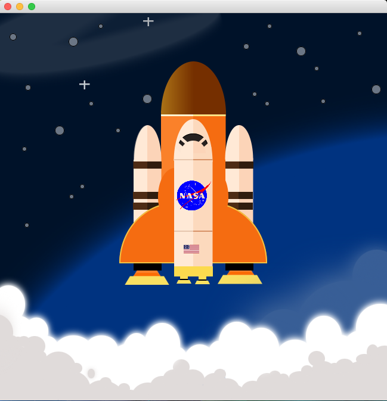

# Project No. 3


Write a JavaFX scene that draws a picture of your choice in a `650 x 650` pixels window. Your picture
must be a **coherent, describable depiction of a scene**. For example, “rocket ship traveling through
space”, “at home taking care of my garden” are acceptable, but “bunch of shapes on a dark background”
is not. In addition, it must include the following:

- At least 7 distinct colors
- Must use the following classes at least once in a non-trivial manner: 
    - [x] Color
    - [x] Pane
    - [x] Image
    - [x] ImageView
    - [x] Line
    - [x] Circle
    - [x] Rectangle
    - [x] Ellipse
    - [x] Arc
    - [x] Polygon
    - [x] Polyline
    
For this assignment, you must actually draw the picture in the scene with the methods available in JavaFX
classes. You are not restricted to methods discussed in class, but you are restricted to JavaFX classes and
methods.

In addition to your source code, your file should contain thorough documentation (comments) that
describes what the code does. Since this program draws a picture, your comments should narrate what is
being drawn, as in the example below:

```
// Sets up picture background
… code that sets up background goes here

// Draws a crescent moon in the sky
…code that draws a moon in the sky goes here
```

# Idea

> Draw a rocket Image


# Result

> Static 



> See non-static above

# Yeap

2018 © **AAA Group**
