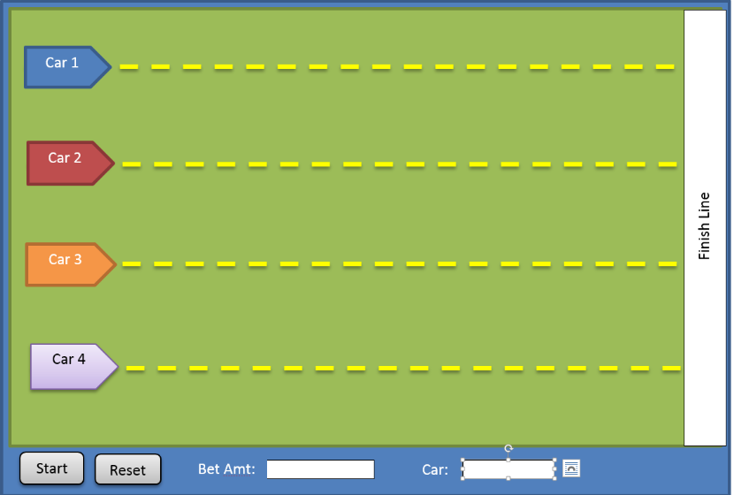

# Project No. 4

Write a java class named RobotRace (extend JavaFX application, use java FX shapes, animation, etc. as
appropriate) that implements a robot racing animation with betting capabilities. The application must
contain/do the following:

- Size 600 x 600 pixels.
- Robot themed race tract.
- Be multithreaded.
- 5 robots with different numbers (you can use pictures if necessary) or design your own (be
creative).
- A button to start the race and a button to reset the race.
- A text field to enter a betting amount (whole dollars only max. $1000).
- A text field to enter the number of the robot the user is betting on (validate 1..5).
- When the application starts, all robots are on the left of the screen, at least 20 pixels away from
each other.
- When the start race button is pressed, the robots will start running from left to right until they
reach the right side of the scene.
- Randomize the movement of the robots so they don’t all move at the same speed. This will add
some unpredictability to the game. Your game needs to be able to detect when a robot has reached
the end of the race track and record the order of arrival of the robots.
- When all the robots have finished the race, check if the robot the user bet on is in first, second or
third place.
    - If the robot the user bet on finished in first place, the user won his/her betting amount *
$1000. Display a message congratulating him/her and showing the amount won.
    - If the robot the user bet on finished in second place, the user won his/her betting amount *
$500. Display a message congratulating him/her and showing the amount won.
    - If the robot the user bet on finished in third place, the user won his/her betting amount *
$250. Display a message congratulating him/her and showing the amount won.
- If the robot the user bet on finished in fourth place, display a message informing the user of this
fact

**Notes:**

- In addition to your source code, your file should contain thorough documentation that describes
what the code does.
- 2 out 10 points will be given for creativity and 8 out 10 points will be based on how well the code
is written.

```
Place the following header on top of your files:
/*-- -- -- -- -- -- -- -- -- -- -- -- -- -- -- -- -- -- -- -- -- -- -- -- -- -
Group Members: Name of all group members
Student IDs: Student IDs of Group members
COP 2805C –Java Programming 2
Spring 2018 - T Th 6:15 PM - 9:30PM
Project # 4
Plagiarism Statement: I certify that this assignment is my own work and that I have not copied in part or
whole or otherwise plagiarized the work of other students and/or persons.
-- -- -- -- -- -- -- -- -- -- -- -- -- -- -- -- -- -- -- -- -- -- -- -- -- -- -- -- -- */
```

Submission guidelines: Send your code files (RobotRace.java,) as attachment to my email
rcruz2@mdc.edu, with the subject Adv. Java Project 4




# Yeap

2018 © **AAA Group**
